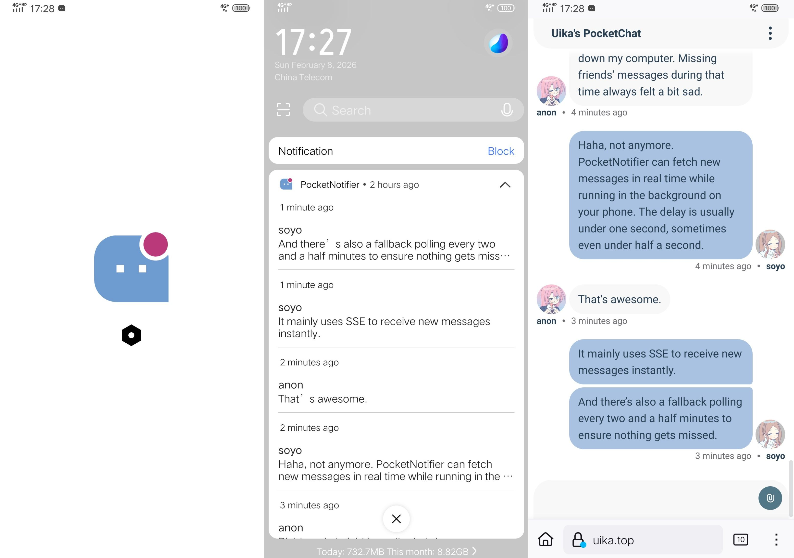
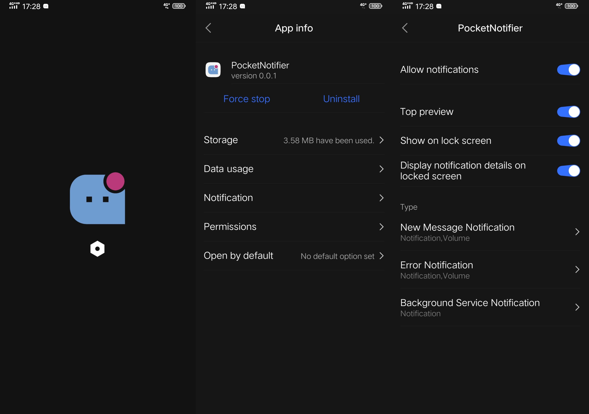

<div align="center">
  
</div>

<h1 align="center">
  PocketNotifier
</h1>

<p align="center">
  <!-- Kotlin -->
  <a href="https://kotlinlang.org/" target="_blank"></a>
  <!-- Android -->
  <a href="https://developer.android.com/" target="_blank"></a>
  <!-- PocketBase -->
  <a href="https://pocketbase.io/" target="_blank"></a>
  <!-- License -->
  <a href="https://opensource.org/licenses/MIT" target="_blank"></a>
  </br>
  <!-- Discord -->
  <a href="https://discord.gg/aZq6u3Asak"></a>
  <!-- Telegram -->
  <a href="https://t.me/PocketTogether"></a>
</p>

<p align="center">
  English | <a href="./README.md">简体中文</a>
</p>

- **PocketNotifier** is a real‑time notification Android app designed as a companion to the open‑source chat platform [PocketChat](https://github.com/PocketTogether/pocket-chat).
- Built with **Kotlin** as a native Android application, the APK is only about **1.6 MB**, and its runtime memory usage is minimal.
- It receives new chat messages in real time while running in the background, with latency typically **below one second**, sometimes even **under half a second**, depending on network conditions.
- Real‑time updates are powered primarily by **SSE (Server‑Sent Events)**, with an additional **2.5‑minute polling fallback** to ensure no messages are missed.
- When the app is reopened after being closed, it fetches historical messages and notifies the user of any messages received during the downtime.
- The current configuration is tailored for **[sakiko.top](https://sakiko.top)**. By forking this project, you can easily build a dedicated notification app for any other PocketChat instance.
- GitHub Actions is fully configured, so you can modify project settings and build APKs **entirely on GitHub**, without setting up a local environment.
- Project repository: [https://github.com/PocketTogether/pocket-notifier](https://github.com/PocketTogether/pocket-notifier)





## Usage Guide

You can download the APK from the **Releases** page, such as `SakikoNotifier-v0.0.1.apk`.

After installing and opening the app, you will see a **main icon** and a **settings icon**:

- Tapping the **main icon** opens the corresponding website. It also indicates whether the app is running normally.
- Tapping the **settings icon** opens the system’s App Info page, where you can configure notification permissions.


### Enable Notifications

Tap the settings icon to open the system App Info page.

Enable notifications for the app, and optionally adjust the behavior of each notification category.

There are three notification types:

- **New Message Notification** — triggered when new messages arrive  
- **Error Notification** — triggered when network or other errors occur  
- **Background Service Notification** — indicates that the app is running in the background  


### Confirming the App Is Running Normally
The main icon indicates whether the app is running normally: when everything is functioning correctly, the icon displays a red dot; when it is not, the icon appears without the red dot.

<table>
  <tr>
    <th><strong>Request Successful (Normal Operation)</strong></th>
    <th><strong>Initial Request Pending / Request Failed</strong></th>
  </tr>
  <tr>
    <td align="center"></td>
    <td align="center"></td>
  </tr>
  <tr>
    <td>Indicates that the most recent request succeeded. The app is functioning normally, and the main icon displays a red dot.</td>
    <td>Indicates that no successful request has been made yet, or the most recent request failed. The main icon does not display a red dot.</td>
  </tr>
</table>


### Preventing the App From Being Killed by the System

Different Android manufacturers apply aggressive background process management. To ensure continuous operation, configure the following:

#### 1. **Lock the App in the Recent Tasks Screen**

Open the recent tasks view (gesture, long‑press home, or square button), find this app, and tap the **lock icon** to keep it in a locked state.

Locked apps are less likely to be terminated by system cleanup or background policies.

#### 2. **Enable Auto‑Start**

Go to:  
**System Settings → App Management → Permissions → Auto‑start**

Add this app to the allowed auto‑start list so it can restart automatically if the system kills it.

#### 3. **Allow Background Activity / Disable Battery Optimization**

Names vary by manufacturer, but look for options such as:

- **Battery → High Background Power Usage → Allow**
- **Battery Management → Don’t Optimize / Allow Background Activity**
- **Power Saving → Allow Background Running**
- **App Info → Battery → Unrestricted**

> PocketNotifier consumes very little power in the background, but allowing unrestricted background activity ensures stable operation.


## Development Guide

The current project configuration is tailored for **https://sakiko.top**, meaning it will only fetch notifications from the PocketChat site at **sakiko.top**.

After forking this project, you can build a dedicated App for any other PocketChat site.

GitHub Actions is already configured, so you **do not** need to set up any local environment or pull the code.  
You can modify the project configuration and build the APK entirely on GitHub.

Below is an example of forking and modifying the project, using **https://uika.top** as the target PocketChat site.


### 1. Fork the Project

Fork this project:  
https://github.com/PocketTogether/pocket-notifier

Then open your forked repository, such as:  
`https://github.com/<USERNAME>/pocket-notifier`


### 2. Modify Project Files

There are **four** main files to modify:

1. `app/build.gradle.kts` — change the applicationId  
2. `app/src/main/AndroidManifest.xml` — change the app name  
3. `app/src/main/java/com/pocket/notifier/config/Config.kt` — change the site URL  
4. `.github/workflows/android.yml` — change the APK filename


#### (1) Modify the Application ID

```
app/build.gradle.kts
```

```kotlin
// ...
android {
    // ...
    defaultConfig {
        // Application ID — should be modified
        applicationId = "top.uika.pocket_notifier"

        // Version code — optional to modify
        versionCode = 1
        // Version name — optional to modify
        versionName = "0.0.1"

        // ...
    }
    // ...
}
```

**Application ID (applicationId)**  
- Must contain at least one dot `.`
- Can only include letters, digits, underscores `_`, and dots `.`
- Does **not** need to be a real domain, nor do you need to own it
- As long as the applicationId is different, Android treats it as a completely separate app

**Version numbers (versionCode / versionName)**  
- `versionCode`: must be an integer and must increase with each release  
  Example: 1 → 2 → 3  
  Android uses this to determine which version is newer.
- `versionName`: shown to users, any string format is allowed  
  Examples: `0.0.1`, `1.2.0`, `2025.01.01`  
  No strict format required.


#### (2) Modify the App Name

```
app/src/main/AndroidManifest.xml
```

```xml
<?xml version="1.0" encoding="utf-8"?>
<manifest xmlns:android="http://schemas.android.com/apk/res/android">
    <!-- ... -->
    <!-- android:label is the app name — should be modified -->
    <application
        android:label="UikaNotifier"
        android:icon="@mipmap/ic_launcher"
        android:theme="@style/Theme.PocketNotifier">
    <!-- ... -->
    </application>
</manifest>
```

`android:label="UikaNotifier"` is the app name and should be modified.

**About `android:icon="@mipmap/ic_launcher"`**  
This is the app icon. If you want to replace it, update the following files with correctly sized images:

```
48x48px
app/src/main/res/mipmap-mdpi/ic_launcher.png

72x72px
app/src/main/res/mipmap-hdpi/ic_launcher.png

96x96px
app/src/main/res/mipmap-xhdpi/ic_launcher.png

144x144px
app/src/main/res/mipmap-xxhdpi/ic_launcher.png

192x192px
app/src/main/res/mipmap-xxxhdpi/ic_launcher.png
```

Other images are stored in `app/src/main/res/drawable`, and can also be modified:

```
Image shown on the homepage when request fails
app/src/main/res/drawable/failure.png

Image shown on the homepage when request succeeds
app/src/main/res/drawable/success.png

Notification SmallIcon
app/src/main/res/drawable/ic_notify.xml
```


#### (3) Modify the Website Configuration

```
app/src/main/java/com/pocket/notifier/config/Config.kt
```

Mainly modify `POCKETCHAT_BASE_URL`.

```kotlin
object Config {
    /**
     * Website URL — should be modified
     */
    const val POCKETCHAT_BASE_URL: String = "https://uika.top"

    /** URL opened when clicking the main image */
    const val CLICK_URL: String = "${POCKETCHAT_BASE_URL}"

    /** Polling request path */
    const val REQUEST_URL: String =
        "${POCKETCHAT_BASE_URL}/api/collections/messages/records?page=1&perPage=20&expand=author&sort=-created%2Cid&skipTotal=true"

    /** SSE realtime connection endpoint (GET /api/realtime & POST /api/realtime) */
    const val REALTIME_URL: String = "${POCKETCHAT_BASE_URL}/api/realtime"

    /** Request timeout (seconds) */
    const val REQUEST_TIMEOUT_SECONDS: Long = 10

    /** Polling interval (seconds) */
    const val POLLING_INTERVAL_SECONDS: Long = 150

    /**
     * Single SSE session duration (seconds)
     *
     * Browser sessions disconnect around 1 minute (likely due to Cloudflare),
     * so this is set slightly shorter for better control.
     */
    const val REALTIME_SESSION_SECONDS: Long = 55

    /**
     * SSE subscription string
     * options={"query":{"expand":"author"}}
     */
    const val REALTIME_SUBSCRIPTION: String =
        "messages/*?options=%7B%22query%22%3A%7B%22expand%22%3A%22author%22%7D%7D"

    /** Maximum number of messages stored locally (cleanup triggered when exceeded) */
    const val MESSAGE_STORE_MAX = 200

    /** Number of messages to keep after cleanup */
    const val MESSAGE_STORE_TRIM_TO = 100

}
```


#### (4) Modify the APK Filename

```
.github/workflows/android.yml
```

Modify `APK_BASENAME`.

```yml
name: Android Release Build

env: 
  # APK filename in GitHub Release — should be modified
  # Final APK name will be something like APK_BASENAME-v0.0.1.apk
  APK_BASENAME: "PocketNotifier"

on:
  release:
    types: [published]
  workflow_dispatch:

# ...
```


### 3. Release & APK Build

GitHub Actions is already configured (see `.github/workflows/android.yml`).

The APK build process is triggered **automatically** when you publish a GitHub Release:

1. Create a new Release in your forked repository  
2. Set a version tag (e.g., `v0.0.1`)  
3. Click **Publish release**  
4. GitHub Actions will start building the APK  
5. You can view progress in the **Actions** tab  
6. After completion, the APK will be uploaded to the Release page  

The entire process can be done on GitHub without any local environment.


### 📌 Additional Note: Using GitHub Organizations to Achieve “Multiple Forks”

GitHub rule:  
**A single account can only fork the same repository once.**

If you need multiple forks (e.g., one dedicated App per PocketChat site), you can create **free GitHub Organizations**.

Each Organization can fork the same repository once, giving you multiple independent forks.

Each fork will have:

- Its own configuration  
- Its own GitHub Actions build pipeline  
- Its own Releases  
- The ability to sync updates from upstream  

This is especially useful for PocketNotifier, allowing each PocketChat site to have its own dedicated notification App.

